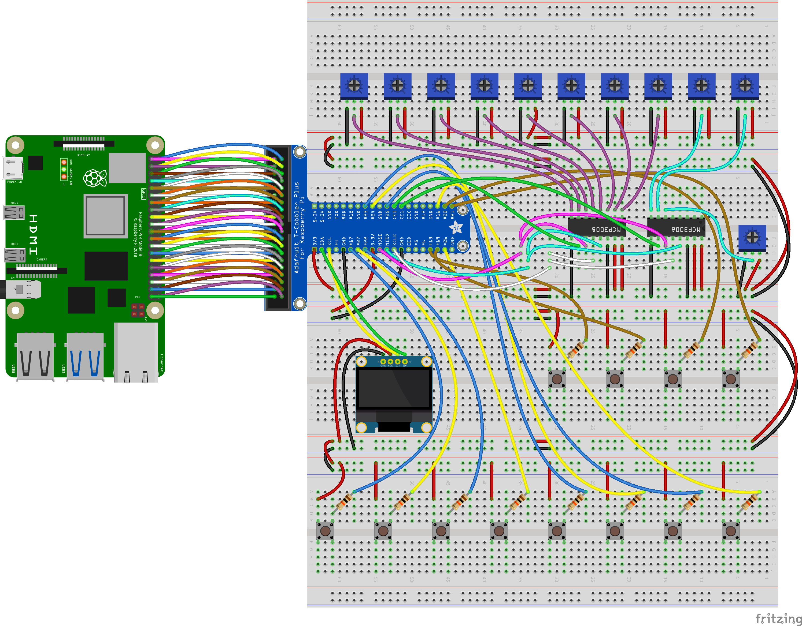
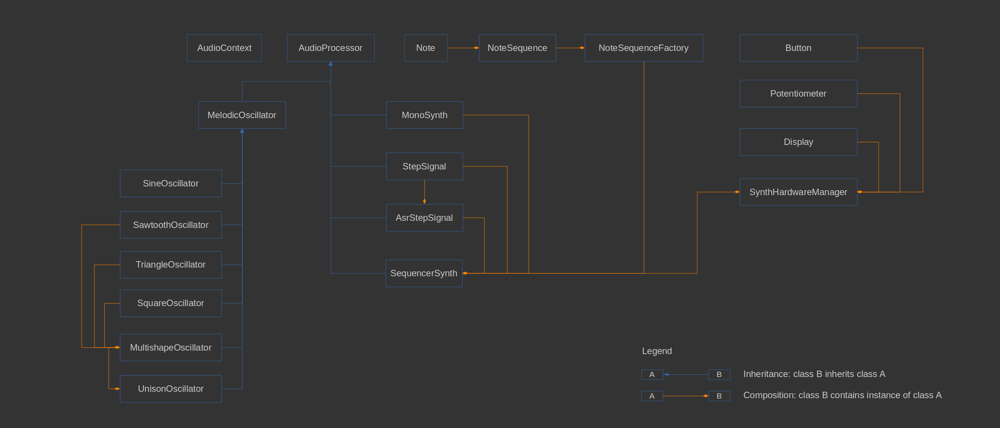

# Raspberry Pi 80s-style synthesizer anfd sequencer

#### Description:
This is a synthesizer made with Raspberry Pi, C++ the WiringPi library.
For outputing audio, the RtAudio library is used.

#### Features:
* one unison oscillator with 3 shapes: triangle, sawtooth and square
* for the unison oscillator we can choose between 1 and 5 oscillators that run in unison
* available settings for the synth:
    * octaves offset
    * semitones offset
    * triangle shape amount
    * sawtooth shape amount
    * square shape amount
    * unison oscillators count
    * global volume
* 8-step sequencer with 8 predefined sequences/arpeggios
* the user can select one of the 8 predefined arpeggios and then change each note individually, via 8 potentiometers
* settings for sequencer:
    * tempo (BPM)
    * adjust each note of the sequence/arpeggio (+-12 semitones)

#### Hardware used:
* Raspbery Pi 4 4Gb
* 2 analog to digital converters (ADC) with 8 channels: Microchip MCP3008 (because the Raspberry Pi does not have analog pins)
* T-Cobbler breadboard adapter for Raspberry Pi
* 11 potentiometers
* 12 buttons (switches)
* SSD1306 OLED Display

#### Short Online video: [youtube](https://youtube.com/shorts/kLM_OgGITTw?feature=share) 
Observation: this video is for demonstrative purposes only, so it's quality is not very high and it's length isn't very big either. Appologies for that.

License: GNU GENERAL PUBLIC LICENSE Version 3