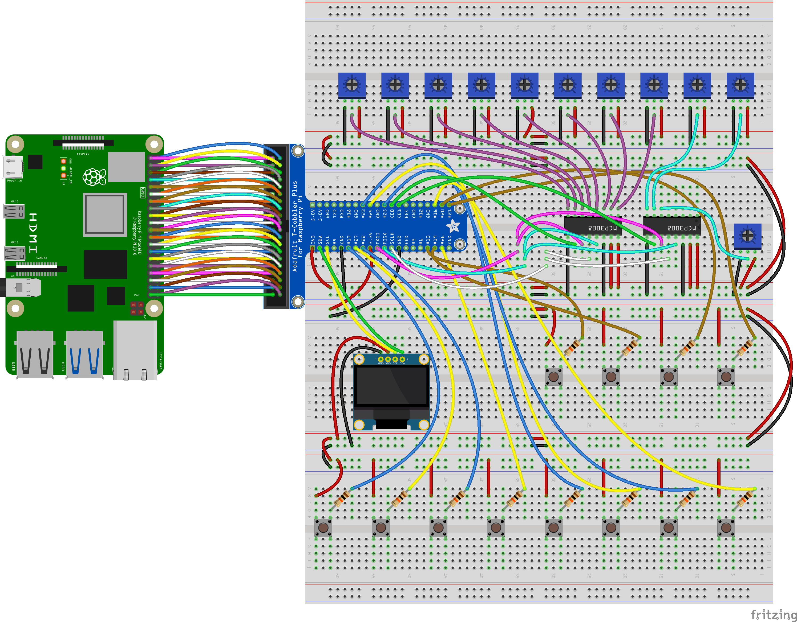
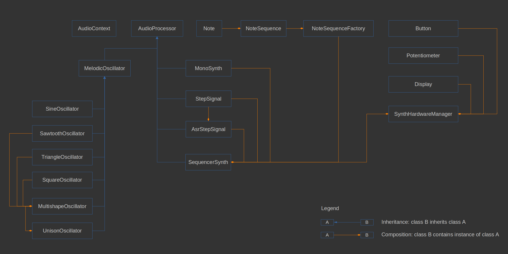
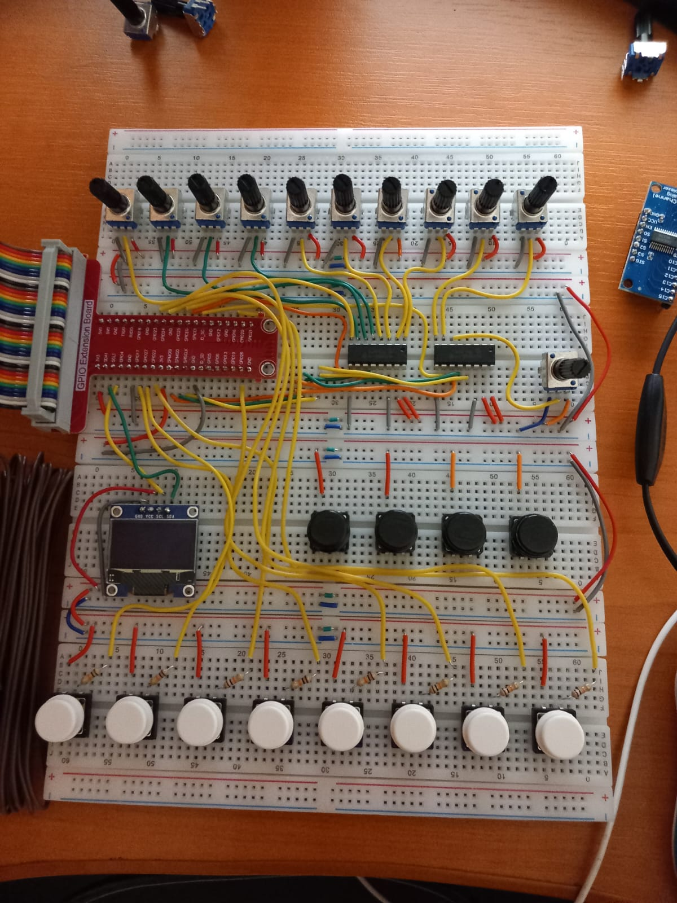
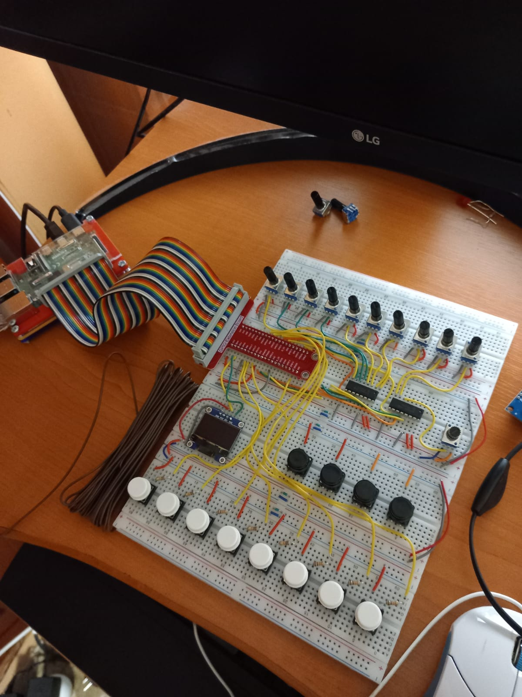

# Raspberry Pi 80s-style synthesizer and sequencer

#### Description:
This is a synthesizer made with Raspberry Pi, C++ the [WiringPi](https://github.com/WiringPi/WiringPi) library.
For outputing audio, the RtAudio library is used.

For connecting with the SSD1306 OLED Display, the [Display_Lib_RPI](https://github.com/gavinlyonsrepo/Display_Lib_RPI) is used.

For general audio output on Linux, the [RtAudio](https://github.com/thestk/rtaudio) library was used.

#### User features:
* one unison oscillator with 3 shapes: triangle, sawtooth and square
* for the unison oscillator we can choose between 1 and 5 oscillators that run in unison
* available settings for the synth:
    * octaves offset
    * semitones offset
    * triangle shape amount
    * sawtooth shape amount
    * square shape amount
    * unison oscillators count
    * global volume
* 8-step sequencer with 8 predefined sequences/arpeggios
* the user can select one of the 8 predefined arpeggios and then change each note individually, via 8 potentiometers
* settings for sequencer:
    * tempo (BPM)
    * adjust each note of the sequence/arpeggio (+-12 semitones)

#### Programming features:
* though Raspberry Pi is made to work mostly with Python, C++ is used instead through the **WiringPi** library, to have good performance, since audio programming is very demanding
* the API designed allows to make custom audio nodes that simulate being "connected" togheter like in [Web Audio API](https://developer.mozilla.org/en-US/docs/Web/API/Web_Audio_API), though it's not as advanced
* the base class for nodes that can be "connected" togheter is **AudioProcessor**
* we can connect toghether as many **AudioProcessors** as we want
* has two **AudioProcessors** that generate a 'step signal':
    * a simple stepped signal
    * an ASR (Attack-Sustain-Release) stepped signal
* has an **AudioContext** just like [Web Audio API](https://developer.mozilla.org/en-US/docs/Web/API/Web_Audio_API)
* the hardware buttons, potentiometers and OLED display are abstracted away through custom C++ classes that makes them behave more like regular UI objects, instead of actual hardware
* there is even a **SynthHardwareManager** class that abstracts away even the C++ objects that abstract the physical hardware components (buttons, potentiometers, etc.), so that the synthesizer gets its required parameters (frequency, unison, etc.) directly, whithout having to know about what buttons or potentiometers provide those values
* the hardware buttons use the Raspberry Pi built-in **pull-up/pull-down resistors** to avoid being in the *floating state* (an undefined state, neither HIGH nor LOW), in this case it uses those resistors in **pull-down** mode
* the hardware buttons are connected to those Raspberry Pi pins which are in **pull-down** mode by default
* **SPI** is used indirectly (through the [WiringPi](https://github.com/WiringPi/WiringPi) library) to communicate with the 2 Microchip MCP3008 analog to digital converters (ADC)
* **I2C** is used indirectly (through the [Display_Lib_RPI](https://github.com/gavinlyonsrepo/Display_Lib_RPI) library) to communicate with the SSD1306 OLED Display
* static allocation of variables is used as much as possible, in order to avoid C++ memory leaks
* because there are so many files in the project, the compilation is made with Linux shell scripts which send the files to the actual g++ compiler:
    * *build-desktop.sh* for desktop computers (this is just for reference, it should not be used, because a regular desktop computer does not have the Raspberry Pi hardware)
    * *build-rpi.sh* for a Raspberry Pi device, this compiles the actual project but it requires a Raspberry Pi device

#### Hardware used:
* Raspbery Pi 4 4Gb
* 2 analog to digital converters (ADC) with 8 channels: Microchip MCP3008 (because the Raspberry Pi does not have analog pins, so we need to convert from analog to digital)
* T-Cobbler breadboard adapter for Raspberry Pi
* 11 potentiometers
* 12 buttons (switches)
* SSD1306 OLED Display
* 3 breadboards

Schematic

C++ class diagram

Pictures

#### License:
MIT License

#### Notice:
Previously, this software was released under the GNU GPL License v3, since the [Display_Lib_RPI](https://github.com/gavinlyonsrepo/Display_Lib_RPI) library was also released under the same license. Now it appears the the **Display_Lib_RPI** is relicensed under the more permissive MIT license, so I relicensed this code under the MIT license, since I am the only contributor to it.